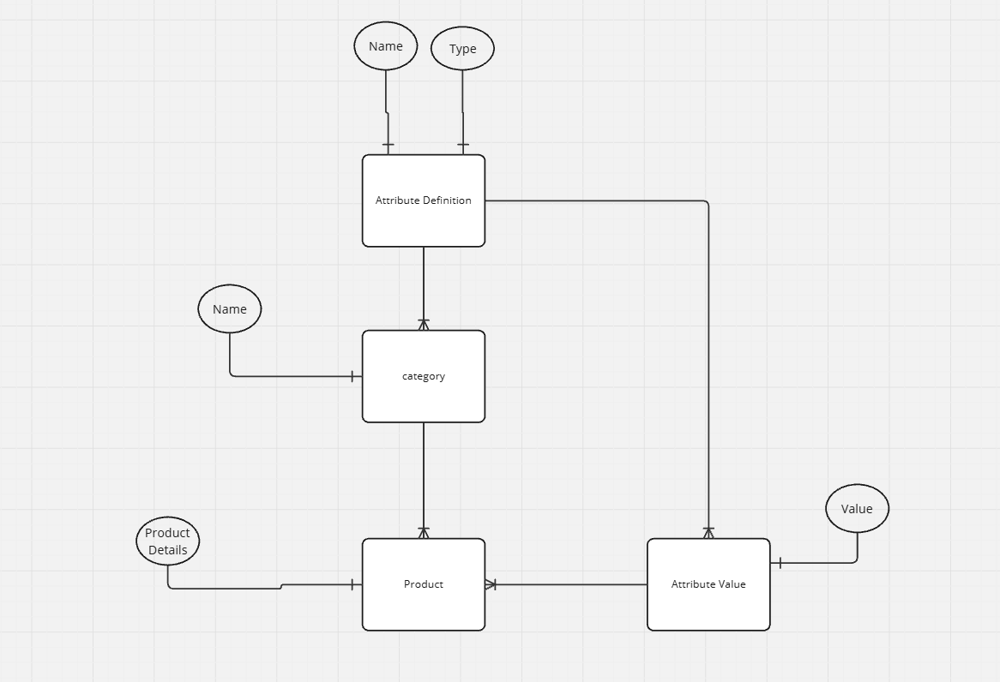

# Product Management Models

This project defines a data model for managing products, their categories, attributes, and attribute values using Django's ORM. The design supports flexible categorization, dynamic attributes, and detailed product information.

## Data Model Digram

## Models

### Category
Represents a category to which products can belong.

- **Fields:**
  - `name`: A unique name for the category.

- **Relationships:**
  - One-to-Many with `Product` (a category can have multiple products).
  - One-to-Many with `AttributeDefinition` (a category can define multiple attributes).

- **Methods:**
  - `__str__`: Returns the category name.

---

### AttributeDefinition
Defines custom attributes that can be associated with a specific category.

- **Fields:**
  - `name`: The name of the attribute.
  - `data_type`: Specifies the type of data the attribute will hold. Options include:
    - `string`
    - `integer`
    - `boolean`
    - `float`
  - `category`: A foreign key linking the attribute definition to a category.

- **Relationships:**
  - Many-to-One with `Category` (an attribute belongs to one category).
  - One-to-Many with `AttributeValue` (an attribute can have multiple values for different products).

- **Methods:**
  - `__str__`: Returns the attribute name and data type in the format: `name (data_type)`.

---

### Product
Represents a product with details and associated category.

- **Fields:**
  - `name`: The name of the product.
  - `description`: A text description of the product.
  - `price`: The price of the product as a decimal value.
  - `images`: A JSON field to store a list of image URLs.
  - `category`: A foreign key linking the product to a category.

- **Relationships:**
  - Many-to-One with `Category` (a product belongs to one category).
  - One-to-Many with `AttributeValue` (a product can have multiple attribute values).

- **Methods:**
  - `__str__`: Returns the product name.

---

### AttributeValue
Represents the value of a specific attribute for a particular product.

- **Fields:**
  - `product`: A foreign key linking the value to a product.
  - `attribute`: A foreign key linking the value to an attribute definition.
  - `value`: Stores the value of the attribute as text to support multiple data types.

- **Relationships:**
  - Many-to-One with `Product` (an attribute value belongs to one product).
  - Many-to-One with `AttributeDefinition` (an attribute value corresponds to one attribute).

- **Methods:**
  - `__str__`: Returns a string in the format: `product name - attribute name: value`.

---

## Approach and Model Relationships

This model structure enables flexibility and scalability:
1. **Dynamic Attributes:** Attributes are defined at the category level and can differ between categories. Products within the same category share the same attribute definitions.
2. **Decoupled Data:** Attributes and their values are stored separately, allowing for easy extension and querying of products with specific characteristics.
3. **Extensibility:** The JSON field in the `Product` model supports multiple image URLs. The design can be extended with additional fields or models without disrupting the existing structure.
4. **Consistency:** The relationships ensure each product is associated with a single category and each attribute value corresponds to a specific attribute and product.

This setup is ideal for systems where products have variable characteristics depending on their category.
